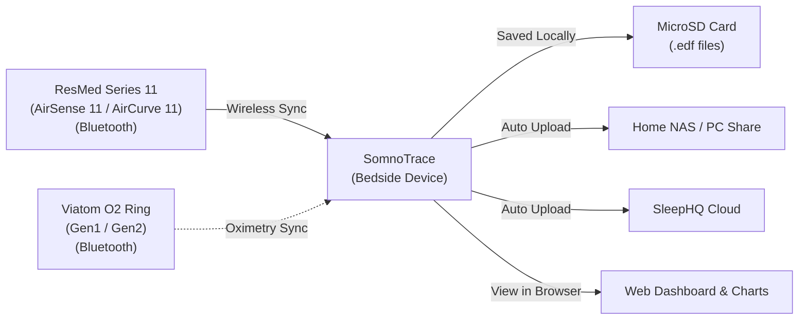
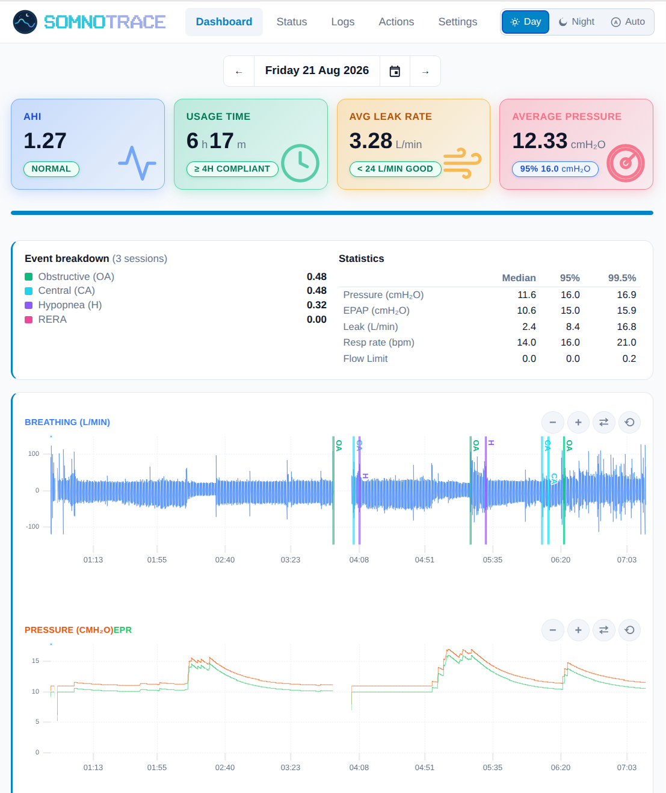

<p align="center">
  
</p>

> A plug-and-play wireless bridge that pulls CPAP therapy and pulse oximetry data over Bluetooth, automatically saves standard European Data Format (EDF) files, and uploads them to your home network (NAS/SMB) or SleepHQ — **no SD card swapping or Wi-Fi SD cards required**.

Created and architected by **Ilya Kruchinin** ([@ilyakruchinin](https://github.com/ilyakruchinin)).  
Spiritual successor to [CPAP-AutoSync](https://github.com/ilyakruchinin/CPAP-AutoSync), transitioning from software-only sync to a dedicated, standalone hardware device.

---

## What Makes SomnoTrace Unique?

SomnoTrace is the **first and only** open-source project that delivers:

- 📡 **Wireless Therapy Data via BLE — No SD Card or WiFi SD Card Needed:**  
  SomnoTrace pulls detailed sleep therapy data directly from ResMed Series 11 machines (AirSense 11 / AirCurve 11) over Bluetooth Low Energy (BLE) — **no SD card required in the CPAP machine at all**. This replaces both the daily ritual of physically swapping SD cards and the need for WiFi SD card adapters (such as EZShare). Your therapy data is captured wirelessly as you sleep.
- ⏱️ **Zero Clock Drift (Perfect Pulse Oximeter Sync):**  
  The AirSense 11's built-in clock drifts over time (often by minutes), causing your CPAP graphs and pulse oximeter graphs to be misaligned in OSCAR and SleepHQ. SomnoTrace continuously aligns therapy records to exact internet time (NTP), delivering sample-accurate synchronization with your oximetry data (such as the Wellue O2 Ring).
- 🚨 **Interrupted Therapy Alerts (Insurance Compliance & Safety):**  
  If your mask slips off or therapy stops unexpectedly during the night, SomnoTrace alerts you immediately. It sends a push notification to your phone, smartwatch (Apple Watch, Garmin, WearOS), or smart bed shaker via [ntfy](https://ntfy.sh). If unacknowledged, an escalating audible alarm sounds on the device speaker, helping you preserve required insurance compliance hours and prevent unmanaged apnea.
- ⚡ **ResMed BLE → Wi-Fi Bridge & Smart Home Automations:**  
  SomnoTrace bridges the machine's encrypted Bluetooth link to your local Wi-Fi network. You can query machine settings, start/stop therapy remotely, or build rich [Home Assistant automations](docs/automations.md) (e.g. automatically turn off bedroom lights when you start therapy).

---

## Key Benefits

- **No more daily SD card swapping:** Therapy data is pulled wirelessly from your CPAP machine over Bluetooth — **no SD card needed in the machine at all**. Files are saved automatically to SomnoTrace's onboard MicroSD card.
- **Automatic uploads:** Sends your completed sleep sessions directly to your local computer / NAS share (SMB) and [SleepHQ](https://sleephq.com) as soon as therapy stops.
- **Built-in color screen & live breathing graphs:** View real-time airflow graphs, Wi-Fi status, battery level, and clock directly on the bedside device.
- **Easy-to-use Web Dashboard:** Connect from your phone, tablet, or computer browser to see interactive sleep charts, AHI metrics, leak rates, and device settings.
- **Camping Mode (Temporary Offline Use):** SomnoTrace can record therapy data without any internet connection — all you need is the AirSense 11 nearby. See the [Camping Mode guide](#camping-mode-offline-use) below for details.

---

## Hardware


SomnoTrace runs on a compact, affordable, all-in-one development board:

- **Hardware Board:** **[Waveshare ESP32-S3-Touch-LCD-1.54](https://www.waveshare.com/esp32-s3-lcd-1.54.htm?sku=33869)**  
  *(The **touch variant with battery** is strongly recommended for portable bedside use).*
- **Display:** 1.54" round-corner color screen with touch control.
- **Storage:** MicroSD card slot for saving high-resolution sleep data and EDF files.
- **Audio:** Onboard speaker for therapy alerts and status tones.
- **Power:** USB Type-C or internal rechargeable battery with smart charging.

**Additional accessories required:**
- micro-SDHC card (8 GB minimum, 16 GB+ recommended; U1 or U3 speed class)
  - goes inside the WaveShare board for internal file storage
- USB-C data cable (for initial flashing and charging)
- USB-C charger (for overnight power)

---

## Supported Devices

- **Supported CPAP Machines:**
  - ResMed AirSense 11 (AutoSet / Elite)
  - ResMed AirCurve 11 (VAuto / ASV)
- **Supported Pulse Oximeters:**
  - **O2 Ring S (Gen2)** — Viatom model PO2B (S8-AW). Also sold as: 
    - Wellue O2Ring S
    - SleepHQ O2 Ring Pro.
  - **O2 Ring (Gen1, experimental)** — Viatom model PO2 (S9). Also sold as:
    - Wellue O2Ring
    - LOOKEE O2Ring
    - SleepHQ O2 Ring (non-Pro)

<br clear="right"/>

<details>
<summary><b>🔋 Battery & Power Guidelines — important, please read</b></summary>

> SomnoTrace is designed to run on **stable USB-C power**. The internal battery is a safety net, not a primary power source.

**Always connect USB-C power** during overnight therapy recording. The battery exists for **power outage protection only** — if your electricity drops mid-session, the battery keeps the device alive long enough to finish writing data and shut down safely.

**Running an entire night on battery is strongly discouraged** and may result in data loss. If the battery dies mid-session, the current recording may be incomplete or corrupted. SomnoTrace does its best to flush and close files on low battery, but a sudden power loss during active Bluetooth streaming can still lose the last few seconds of data.

**Battery life (emergency use only):**

| Screen Brightness | Approximate Runtime |
|---|---|
| Medium brightness | 2–3 hours |
| LCD screen off | Up to 11 hours |

These figures are **not** a recommendation to run unplugged overnight.

### Battery Calibration & Why You Might See `--% ⚡` ("Calibrating")

If your screen displays **`--% ⚡`** (or the Web Portal Status shows **`--% ⚡ (Calibrating)`**):

- **If you do NOT have a battery installed (running on USB-C power only):**
  The board's charging pins float at ~4.2 V, causing the firmware to assume an uncalibrated battery is present.
  👉 **Turn off the indicator:** Open the Web Portal, navigate to **Settings → Device Settings**, and toggle **Battery Indicator** to **OFF**. This cleanly hides the battery gauge from the LCD and sets the status to `USB Power (No battery)`.

- **If you DO have a battery installed:**
  SomnoTrace estimates battery percentage from cell voltage rather than a dedicated fuel-gauge chip. When booting or flashing firmware while plugged into USB-C with a high battery charge ($\ge 4.10\text{ V}$), the charger chip actively floats the cell at ~4.2 V. The firmware honestly indicates `--%` rather than guessing a false percentage.
  - **How to calibrate (takes 10 seconds):**
    1. **Unplug the USB-C cable** for 10–15 seconds.
    2. Operating briefly on battery allows the electrochemical surface charge to relax to genuine open-circuit voltage; SomnoTrace will immediately snap to the true percentage.
    3. Once calibrated, the percentage is stored in RTC memory across reboots, and you can plug USB-C back in.
    - *(Alternatively, simply leave it plugged in until the battery reaches 100% full charge; calibration engages automatically upon charge completion).*

</details>

<details>
<summary><b>🔘 Button Controls</b></summary>

The board has three physical buttons on the side. Here's what each one does:

| Button | Action | What It Does |
|---|---|---|
| **BOOT** (left) | Hold 5 seconds | Enters Wi-Fi setup mode (AP hotspot) for initial configuration or network changes. |
| **POWER** (middle) | Single click | Toggles the LCD backlight on or off on demand (or dismisses a temporary wake). Works across all display modes. |
| **POWER** (middle) | Hold 5 seconds | Powers off the device. |
| **POWER** (middle) | Hold 2 seconds | Powers on the device (when off). |
| **PLUS** (right) | Single click | Acknowledges and silences an interrupted therapy alert (if enabled). |
| **PLUS** (right) | Double click | Starts or stops therapy on the AirSense 11 (toggle — same as pressing the machine's own button). |

</details>

<details>
<summary><b>🏕️ Camping Mode (Offline Use)</b></summary>

SomnoTrace can record therapy data with **no Wi-Fi or internet connection at all** — useful for camping, travel, or during internet outages. Here's how it works and what you need to know.

### Prerequisites

Camping mode is **not available out of the box**. The following must be true:

1. **At least one previous online session completed.** SomnoTrace needs to have previously connected to Wi-Fi, synced its clock via NTP, and recorded at least one therapy session with the AirSense 11. This establishes a "clock drift" reference that allows accurate timekeeping without internet.
2. **The AirSense 11 must be paired.** The Bluetooth pairing happens during normal setup — once paired, the bond persists across reboots.

### How to Use It

1. **Turn on your AirSense 11 first**, and wait for it to be ready (screen on, not in a startup/error state).
2. **Then power on SomnoTrace** (plug in USB-C or hold the POWER button for 2 seconds).
3. SomnoTrace will detect that Wi-Fi is unavailable, connect to the AirSense 11 over Bluetooth, and estimate the current time using the stored clock drift.
4. The screen will show an **"Estimated time"** notice — this is normal. Recording proceeds as usual.
5. Therapy data is saved to the MicroSD card. If you have a local NAS/SMB share on a network without internet, uploads to that share will still work.
6. SleepHQ cloud uploads are queued and will upload automatically once internet connectivity is restored.

### Important Notes

- **Always power on the AirSense 11 before SomnoTrace.** SomnoTrace waits up to 30 seconds for the AirSense 11 to connect over Bluetooth at boot. If the AS11 isn't ready in time, the device will retry a few times and may eventually enter Wi-Fi setup mode.
- **The estimated time may drift slightly** over long offline periods, since it's based on the AS11's internal clock plus a previously measured offset. The longer since the last NTP sync, the less precise the timestamp.
- **No data is lost.** Everything recorded during camping mode is stored on the MicroSD card and will upload to SleepHQ once you're back online.

</details>

---

## How It Works



1. **Pair Once:** [Pair SomnoTrace with your ResMed Series 11 machine](docs/pairing.md) and O2 Ring over Bluetooth in seconds using the on-screen menu.
2. **Sleep Normally:** While you sleep, SomnoTrace records airflow, pressure, leak, and respiratory events in real time.
3. **Automatic Processing:** When you turn off your CPAP, SomnoTrace generates standard, bit-accurate EDF files matching native SD card layouts.
4. **Immediate Upload:** Sessions upload automatically to your configured network storage (SMB/NAS) and SleepHQ account.
5. **Wake Up & Review:** Open `http://somnotrace.local` on your phone or laptop to view high-resolution interactive charts and sleep statistics.

---

## Web Dashboard

Access the built-in web portal from any device on your Wi-Fi network without installing any apps:

<p align="center">
  
</p>

- **Interactive Sleep Graphs:** High-resolution zoomable graphs for Breathing Flow, Mask Pressure, Leak Rate, Respiratory Rate, and Flow Limitation.
- **Clinical Sleep Metrics:** AHI, Obstructive Apnea (OA), Central Apnea (CA), Hypopnea (H), RERA, and 95th percentile pressure & leak stats.
- **One-Click Wi-Fi & Device Setup:** Configure Wi-Fi networks, upload destinations, screen brightness, and alert settings with simple toggles.
- **Over-the-Air (OTA) Updates:** Update firmware directly through the web interface with a single click.

---

## Quick Start & Installation

### Option 1: Web Browser Flashing (Recommended — 2 Minutes)

You do **not** need to install any programming tools or compilers. You can flash SomnoTrace directly from **Google Chrome** or **Microsoft Edge**:

1. Download the latest **`-full.bin`** file (e.g., `somnotrace-v1.0.2-full.bin`) from the **[Releases Page](https://github.com/ilyakruchinin/SomnoTrace/releases)**.
   - ⚠️ **Do NOT download the `-ota.bin` file** — that is for over-the-air updates from within the web interface only, and cannot be used for initial flashing.
2. Connect your Waveshare board to your computer with a USB-C data cable.
3. Open the **[Web Flashing Guide](docs/flashing.md)** and follow the 5 simple steps.
4. Connect to the `SomnoTrace-Setup` Wi-Fi hotspot from your phone to enter your home Wi-Fi details.

👉 **[Read the Full Step-by-Step Flashing Guide](docs/flashing.md)**

---

### Option 2: Building from Source (Developers)

If you prefer building from source code, Docker is the only dependency:

```bash
# Compile and create the release image in dist/
./scripts/build-dist.sh

# Or compile and flash directly to a connected board
./scripts/idf.sh -p /dev/ttyACM0 flash monitor
```

---

## Advanced Features & Documentation

- 📖 **[Web Flashing Guide](docs/flashing.md)** — Easy browser-based installation guide for everyone.
- 🔗 **[AirSense 11 Pairing Guide](docs/pairing.md)** — Pair your ResMed CPAP with SomnoTrace over Bluetooth.
- ⚡ **[ResMed BLE RPC Bridge Guide](docs/rpc-bridge.md)** — Send direct queries and commands (`curl` examples) to the AirSense 11 over Wi-Fi.
- 🏠 **[Smart Home & Home Assistant Guide](docs/automations.md)** — Set up bedtime automations, compliance tracking, and mask-off alerts.
- 🛠️ **[Hardware Reference](docs/hardware/README.md)** — Pinouts, schematics, and hardware architecture.

<details>
<summary><b>📁 Accessing Files via FTP</b></summary>

SomnoTrace includes a built-in FTP server for downloading EDF and session files directly from the MicroSD card over Wi-Fi — no need to physically remove the card. FTP is optional and can be enabled or disabled from the web dashboard. By default, it allows anonymous (no password) access on your local network, but you can configure a username and password if you prefer.

Connect with any FTP client (e.g., FileZilla) to `ftp://somnotrace.local`.

> **FileZilla tip:** If you experience connection errors, go to **Site Manager → Edit → Transfer Settings** and set **"Limit number of simultaneous connections"** to **1**. The ESP32-S3 FTP server processes one connection at a time.

</details>

---

## Feature Overview

| Feature | Status | Description |
| :--- | :---: | :--- |
| **ResMed Series 11 Wireless Sync** | ✅ Implemented | Secure Bluetooth connection, live stream recording, and summary data retrieval. Supports AirSense 11 and AirCurve 11. |
| **Standard EDF File Creation** | ✅ Implemented | Generates standard `STR.edf`, `BRP.edf`, `PLD.edf`, `EVE.edf`, and `CSL.edf` files compatible with OSCAR and SleepHQ. |
| **SMB / NAS Network Upload** | ✅ Implemented | Direct file transfer to Windows, macOS, and Linux/Samba shared folders. |
| **SleepHQ Cloud Upload** | ✅ Implemented | Direct HTTPS upload to SleepHQ with fast retry handling. |
| **Web Dashboard & Mobile UI** | ✅ Implemented | Interactive sleep charts, AHI breakdown, status telemetry, and easy setup. |
| **LCD & Audio Alert System** | ✅ Implemented | Bedside color screen, live flow graph, and speaker alert sounds. |
| **Sub-Second NTP Clock Sync** | ✅ Implemented | Internet time sync eliminating AirSense 11 clock drift for pulse oximeter alignment. |
| **Therapy Interruption Alarm** | ✅ Implemented | Push notifications via ntfy (phone/smartwatch/bed shaker) and escalating audio buzzer. |
| **BLE → Wi-Fi RPC Proxy** | ✅ Implemented | Local HTTP endpoint for remote machine queries and smart home control. |
| **FTP File Server** | ✅ Implemented | Download EDF and session files directly from the MicroSD card using any FTP client (e.g., FileZilla). |
| **O2 Ring Bluetooth Sync** | ✅ Implemented | Downloads stored oximetry recordings from Viatom O2 Ring (Gen1 & Gen2) over Bluetooth, with automatic upload to SMB and SleepHQ. |

---

## Contributing

Contributions and ideas are always welcome! Please review [`CONTRIBUTING.md`](CONTRIBUTING.md) before submitting pull requests.

- **Contributor License Agreement:** A [CLA](CLA/individual-cla.md) is required before PRs can be merged (automated on your first PR).
- **Clean-Room Policy:** SomnoTrace is a clean-room implementation based on open protocol documentation. Do not copy third-party source code into this repository.

---

## Acknowledgements

SomnoTrace protocol understanding and interoperability research was informed by the following open-source projects (clean-room implemented — see [`THIRD-PARTY-NOTICES.md`](THIRD-PARTY-NOTICES.md)):

- [airbreak-plus](https://github.com/m-kozlowski/airbreak-plus) — ResMed AirSense 11 BLE protocol reference
- [o2ring-s-protocol](https://github.com/nglessner/o2ring-s-protocol) — Wellue / O2 Ring S (Gen2) BLE protocol reference
- [farolone/wellue-o2ring-protocol](https://github.com/farolone/wellue-o2ring-protocol) — O2 Ring (Gen1) BLE protocol reference
- [OSCAR](https://gitlab.com/pholy/OSCAR-code) — European Data Format (EDF) interoperability and statistical metric reference
- [libsmb2](https://github.com/sahlberg/libsmb2) — SMB2/SMB3 client library (LGPL-2.1)
- [esp-idf-ftpServer](https://github.com/nopnop2002/esp-idf-ftpServer) — Embedded FTP server (MIT)
- [uPlot](https://github.com/leeoniya/uPlot) — Fast time-series charting library (MIT)
- [Roboto Font](https://github.com/google/fonts/tree/main/ofl/roboto) — UI typeface (SIL Open Font License 1.1)

---

## License

SomnoTrace is free software released under the **GNU General Public License v3.0** with an author attribution requirement under **GPLv3 Section 7(b)**.

- Full license text: [`LICENSE`](LICENSE)
- Copyright & Section 7(b) Attribution Terms: [`NOTICE`](NOTICE)

Any redistributed or derivative works must remain licensed under GPLv3 and preserve the author attribution notice:  
> *"Based on SomnoTrace, originally created by Ilya Kruchinin (https://github.com/ilyakruchinin)."*

---

## Medical Disclaimer

SomnoTrace is an independent open-source project and is **not affiliated with, endorsed by, or associated with** ResMed, Wellue / Viatom, or SleepHQ. It is intended strictly for personal data portability and interoperability research. SomnoTrace is **not a medical device** and must not be used for clinical diagnosis, treatment decisions, or life-critical monitoring. Use entirely at your own risk.


