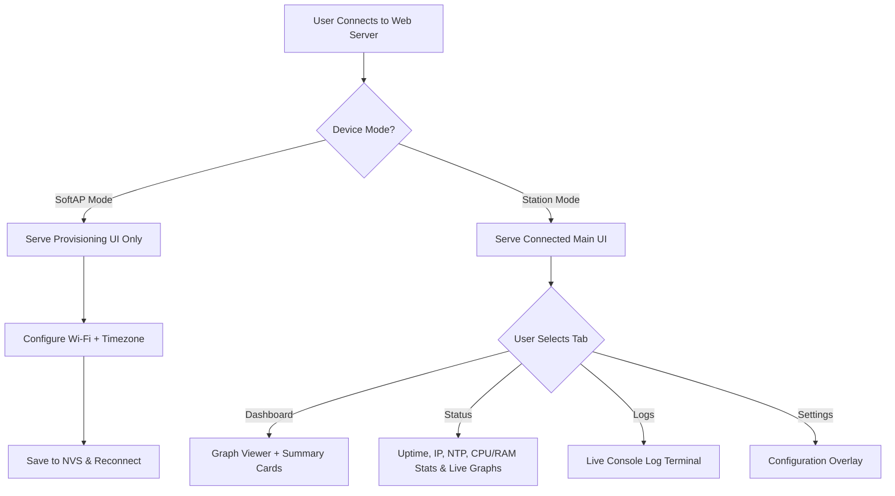

# 0010 — Web UI Architecture & Design Specification

- **Status:** Proposed
- **Author(s):** Antigravity
- **Created:** 2026-07-02
- **Last updated:** 2026-07-02
- **Related specs:** `0006-device-provisioning.md`, `0008-config-and-network-lifecycle.md`, `0009-web-interface.md`

## 1. Summary

This specification defines the architecture, design philosophy, and behavior for the SomnoTrace Web Interface. It details a split-interface approach (Provisioning Mode vs. Connected Mode), specifies the sleep-focused responsive design language, details the custom uPlot integration for interactive CPAP therapy graphs, and defines the simplified setup workflows for Wi-Fi, Timezone, BLE, and Cloud/Network uploads (SMB & SleepHQ).

## 2. Motivation / goals

- **Bedside Usability:** Provide a premium, eye-friendly user interface that integrates well into bedroom environments, supporting dark, light, and auto night-shifting themes.
- **Extreme Portability:** Ensure the entire web application runs as a lightweight, single-page Progressive Web App (PWA) served directly from the ESP32-S3's internal flash.
- **Clarity in Configurations:** Eliminate complex connection settings by offering interactive previews (e.g. SMB connection strings) and streamlined BLE pairing flows.
- **Rich Data Visualization:** Give users deep, responsive insights into their sleep metrics (airflow, leak, and pressure data) without needing third-party cloud tools.

## 3. Non-goals

- Implementing server-side raw EDF parsing on the ESP32-S3 (parsing must be done via lightweight indexing or client-side Javascript where possible to avoid exhausting chip CPU/RAM).
- Supporting general-purpose web browsing or cloud-hosted database persistence on the device.

## 4. Behaviour & Design Philosophy

### 4.1 Visual Aesthetic and Theme Management
- **Aesthetic:** A premium "night-sky" visual theme. Body backgrounds are deep, soothing blues (`#0b0f19`) and rich indigos, accented by distinct, high-contrast colors for therapy graphs. Pure absolute white (`#ffffff`) and absolute black (`#000000`) are prohibited to avoid eye strain.
- **Theme Controls:** A visible selector (segment control or button group) in the header allowing the user to select:
  - **Day Mode:** High-contrast, clean light palette (e.g., background `#f1f5f9`, card background `#ffffff`, text `#0f172a`). Displays a Sun icon and the label "Day".
  - **Night Mode:** Eye-friendly dark palette (e.g., background `#0b0f19`, card background `#111827`, text `#f3f4f6`). Displays a Moon icon and the label "Night".
  - **Auto Mode:** Automatically toggles theme based on local time (Day Mode 08:00 to 20:00, Night Mode outside those hours). Displays a Globe/Gear icon and the label "Auto (Time-based)".
  - **Text Helpers:** Buttons feature clear text descriptions alongside icons to ensure all modes are fully self-explanatory.
- **Mobile Real-Estate Maximization:** On mobile viewports, the padding, margins, and headers shrink to maximize chart canvas height and width, utilizing up to 96% of the physical screen area.

### 4.2 Split-Interface Architecture

The web server serves different layouts based on whether the device is in **SoftAP (Provisioning) Mode** or **Station (Connected) Mode**.

---

## 5. Provisioning UI (SoftAP Mode)

When the device fails to connect to Station Wi-Fi and launches its setup hotspot, it serves a highly focused, distraction-free screen dedicated entirely to onboarding.

### 5.1 Wi-Fi Connection Settings
- **Scan and Group:** The interface automatically triggers a Wi-Fi scan via `/api/scan`. Client-side Javascript groups multiple BSSIDs (e.g., mesh nodes) sharing the same SSID, keeping only the single node with the highest signal strength (RSSI).
- **SSID Dropdown:** The user is presented with a dropdown list of scanned SSIDs sorted by RSSI descending, displaying signal strength icons.
- **Multi-Profile Configuration:** Allows configuring up to **4 distinct Wi-Fi profiles** saved in NVS. The UI displays one card by default, with a clear "+ Add Another Network" button to add additional profile cards.
- **Manual Toggle:** Each Wi-Fi profile slot has a toggle switch to swap between a dropdown list of scanned networks and a manual SSID text field (for hidden networks).
- **Secure Password Input:**
  - Password inputs are masked (`type="password"`) by default.
  - A reveal toggle (eye icon) is present to show the password in plain text.
  - **Crucial Security Rule:** Stored passwords in NVS are **never** returned to the client browser in JSON payloads. When reloading settings, the UI indicates a password is set by showing a placeholder `••••••••` but never exposes the real credentials.

### 5.2 Timezone Settings
- **GMT Offset Input:** Timezone is configured using simple GMT offsets (e.g., `GMT+10:00`, `GMT-05:00`).
- **Future Placeholder:** Designed to support a searchable list of major global cities (using a client-side lookup table) once timezone database support is introduced to the firmware.

---

## 6. Connected Main UI (Station Mode)

When the device successfully joins Wi-Fi, it serves the Main UI. The interface features a clean top header containing the brand name, the **Day / Night / Auto theme selector (with labels)**, and **four main navigation tabs**: **Dashboard**, **Status**, **Logs**, and **Settings**. Profile photos and notification badges are prohibited.

### 6.1 Dashboard Tab

The main workspace containing sleep statistics cards and the multi-axis graph area.

#### A. Session Date Selection & Noon-to-Noon Boundary
- **Single-Night Focus:** The user never views more than a single night's data on screen. The total chart time axis spans a maximum of 24 hours.
- **Noon Boundary:** A session day is defined strictly on a noon-to-noon (12:00 PM to 12:00 PM next day) window.
- **Date Navigation Interface:** 
  - Date selection is performed via a date picker button that launches the native calendar dialog.
  - **No Manual Typing:** Manual keyboard input of the date is disabled to keep the interaction simple and avoid input syntax validation errors. The date picker field is read-only for keyboard entries.
  - **Arrow Stepping:** Flanked by "Previous Day" and "Next Day" buttons for rapid single-night shifting.
- **Localized Date Formatting:**
  - The displayed date formats automatically based on the user's OS/Browser locale settings.
  - If locale detection is unavailable or unsupported, it falls back to a clear `YYYY/MM/DD` format to prevent confusing `MM/DD/YYYY` structures.

#### B. uPlot Graph Viewer
- **Multi-Graph Stack:** Integrates a vertical stack of up to **8 synchronized uPlot graphs** to represent sleep parameters.
- **Distinct Color Coding:** Each graph utilizes a high-contrast, easily distinguishable color palette:
  1. **Airflow Rate:** Teal (`#06b6d4` / `#22d3ee`)
  2. **Therapy Pressure:** Soft Orange (`#f97316` / `#fb923c`)
  3. **Leak Rate:** Purple (`#a855f7` / `#c084fc`)
  4. **SpO2 % (Oximetry):** Bright Blue (`#3b82f6` / `#60a5fa`)
  5. **Pulse Rate:** Red (`#ef4444` / `#f87171`)
  6. **Snore:** Violet (`#6366f1` / `#818cf8`)
  7. **Respiration Rate:** Emerald Green (`#10b981` / `#34d399`)
  8. **Minute Ventilation:** Yellow (`#eab308` / `#facc15`)
- **Synchronized Cursor & Zoom:** Moving the cursor over one graph displays aligned crosshair cursors and synchronized toolbars on all graphs. Horizontal zooming and scrolling are locked in sync across all curves.

#### C. Summary & Device Status Cards
- **Overnight Stats:**
  - **AHI:** Apnea-Hypopnea Index (number of events per hour) with color-coded safety badges (e.g., Green for < 5, Orange for 5–15, Red for > 15).
  - **Usage Time:** Total therapy duration (e.g., `7h 45m`) with visual progress ring.
  - **Leak Percentiles:** 95th and 70th percentile leak statistics.
  - **Average Pressure:** Visual display of therapy pressure metrics.
- **Responsive Layout:** On mobile viewports, cards stack vertically above the graphs. On desktop viewports, they align horizontally above or to the side of the uPlot chart.

### 6.2 Status Tab
A dedicated area showing real-time system metrics:
- **Device Details:** Uptime, current configured timezone offset, local IP address, NTP sync state, and flash storage status.
- **System Graphs (uPlot):** Two small, real-time updated graphs showing:
  - **CPU Load %** over the last 60 seconds.
  - **Free Heap Memory** (split between Internal SRAM and PSRAM) over the last 60 seconds.

### 6.3 Logs Tab
- A scrollable, terminal-style console container duplicating device logs (`stdout`/`stderr`), rendered with the active theme's tokens: dark console in Night mode, light console in Day mode.
- Log lines are color-coded by ESP-IDF level for scannability, using the active theme's tokens: **Error** (`--danger`, bold, tinted row), **Warning** (`--warning`, tinted row), **Info** green, **Debug** muted grey, **Verbose** dim grey. Lines without a recognizable level prefix render in the console's plain text color.
- Connects to `/api/logs/stream` via Server-Sent Events (SSE) or WebSockets to stream log output in real-time.
- Features a "Download Logs" button and a search/filter search box.

### 6.4 Settings Tab
Organized into simple sections:
- **Wi-Fi & Timezone Profile:** Embedded Provisioning UI form for adding/modifying up to 4 Wi-Fi profiles and local offset.
- **SMB Upload Settings:**
  - Standard fields for Host/IP, Share, User, Password, and Subpath.
  - **Connection Preview Helper:** Live display updates in real-time as the user types, formatting the entries into a standard URI: `smb://[username]:[password]@[host]/[share]/[path]`.
- **SleepHQ Upload Settings:** Client ID and Client Secret forms, with last sync timestamp.
- **BLE Pairing:** Pairing controls for ResMed AirSense 11, with a visual "Coming Soon" placeholder for Wellue O2 Ring oximeter central sync.
- **Extra Settings (Placeholder):** Placeholder toggles and inputs for future configurations (smart alarms, brightness control, etc.).

---

## 7. Technical Architecture & Constraints

- **Single-Page Application (SPA) Delivery:** The entire web shell (HTML, CSS, JS) must reside in a single index.html file to optimize file reads on the ESP32-S3. All visual assets must be inline SVGs or dynamically rendered CSS shapes.
- **Asset Compression:** The SPA is stored as a Gzipped binary in the ESP32 flash partition and served with HTTP header `Content-Encoding: gzip` to reduce network transit time.
- **Data Updates (SSE/WebSockets):** Status updates (therapy active, BLE sync progress, WiFi RSSI changes) must use Server-Sent Events (SSE) or WebSockets to keep the dashboard responsive in real-time.
- **Memory Coexistence:** To prevent memory conflicts with BLE and WiFi drivers, the HTTP API endpoints served during active therapy must have a zero-heap-allocation footprint.

---

## 8. Third-Party License Analysis

| Library | License | Commercial Permissibility | Size & Overhead | Justification |
|---------|---------|---------------------------|-----------------|---------------|
| **uPlot** | MIT | YES (Fully compatible with SomnoTrace licensing guidelines) | ~30 KB (JS + CSS) | Industry-leading speed and efficiency for rendering timeseries graphs in a browser. Zero dependencies. |
| **Vanilla CSS/JS** | N/A | YES | 0 KB Overhead | Avoids UI libraries (Tailwind, Bootstrap, React, Vue) to keep flash size minimal and speed fast on ESP32-S3 web server. |

---

## 9. Acceptance Criteria

- [ ] SoftAP mode serves a clean UI focused **only** on Wi-Fi (4 profiles, de-duplicated scan) and Timezone (GMT offset).
- [ ] Stored passwords in NVS are never sent in plain text back to the client web UI.
- [ ] Connected mode serves a header containing Day / Night / Auto selector, brand, and exactly 4 tabs (Dashboard, Status, Logs, Settings).
- [ ] Date navigation is driven by a native Date Picker showing a single night's data (noon-to-noon boundary).
- [ ] Keyboard input / typing on the date picker field is explicitly blocked (readonly input).
- [ ] Theme selector buttons display clear, descriptive text labels alongside their icons.
- [ ] Date formatting prefers OS/browser locale, falling back to `YYYY/MM/DD` format (never `MM/DD/YYYY`).
- [ ] uPlot graphs stack up to 8 parameters, using distinct, high-contrast colors (Teal, Orange, Purple, Blue, Red, Violet, Green, Yellow).
- [ ] Status tab shows device information and live CPU/heap graphs.
- [ ] Logs tab streams device logs in real-time using WebSockets or SSE.
- [ ] Settings tab includes the WiFi config, SleepHQ config, BLE pairing (with O2 Ring placeholder), and SMB connection helper (`smb://...`).
- [ ] Margins and layout automatically maximize display real-estate when running on mobile viewports.

## 10. Changelog

- 2026-07-02: Initial draft detailing design philosophy, split UI states, uPlot integration, and configurations.
- 2026-07-02: Updated navigation tabs (Dashboard, Status, Logs, Settings), removed profile/notifications, added date picker with noon-to-noon boundary, expanded uPlot color palette to 8 distinct parameters, maximized mobile screen real estate, and detailed Status/Logs tabs.
- 2026-07-02: Added keyboard typing prevention to the date picker, localized date format fallback rules (preventing `MM/DD/YYYY`), and text description helper labels to the theme selectors.
- 2026-08-24: Logs Tab console now follows the active Day/Night theme tokens, and log lines are color-coded by ESP-IDF level — errors and warnings use tinted rows, info stays green.
